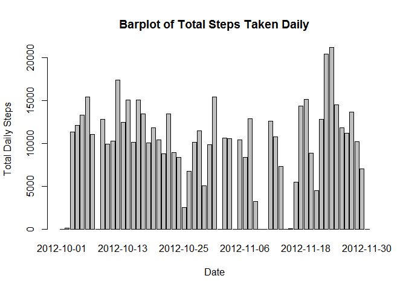
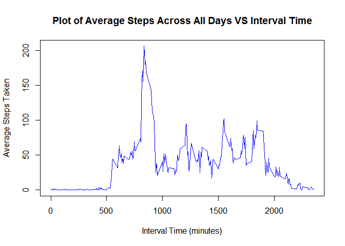
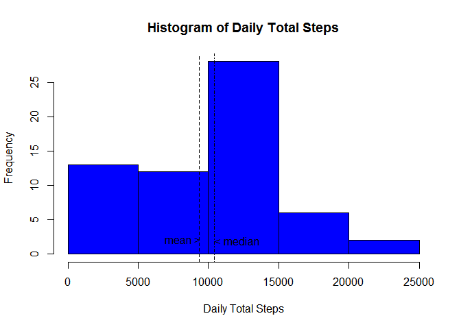
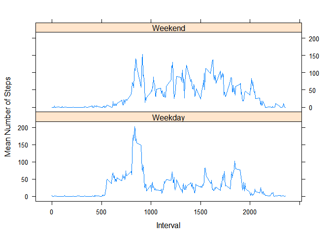

# Reproducible Research: Peer Assessment 1
Chong Zhi Xiong  


## Loading and preprocessing the data
Data is loaded from `activity.csv` file. 


```r
datAct <- read.csv("activity.csv")
```

Now let's take a glimpse at the first few lines of the `datAct` dataset. 

```
##   steps       date interval
## 1    NA 2012-10-01        0
## 2    NA 2012-10-01        5
## 3    NA 2012-10-01       10
## 4    NA 2012-10-01       15
## 5    NA 2012-10-01       20
## 6    NA 2012-10-01       25
```


## What is mean total number of steps taken per day?
Daily total steps are tabulated using `tapply` method, as shown below:


```r
## consolidate a table of total steps by day 
total_steps <- tapply(datAct$steps, datAct$date, sum, na.rm=TRUE)
```

Take a quick look at the `total_steps` dataset, after the dataset has been tidied. 


```
##         Date TotalSteps
## 1 2012-10-01          0
## 2 2012-10-02        126
## 3 2012-10-03      11352
## 4 2012-10-04      12116
## 5 2012-10-05      13294
## 6 2012-10-06      15420
```


Compared to barplot, histogram is more suitable in terms of analysing the `total_steps` dataset. As shown below, the barplot of daily total steps taken depicts the fluctuations of the steps, however does not inform of the mean, median, as well as mode of the dataset.

 

Histogram below depicts the distribution of daily total steps according to frequency. Mean and median for the daily total steps taken are found.   
  
  
Mean of the daily total steps taken is ``9354.23``.   
  
Median of the daily total steps taken is ``10395``.   

 


## What is the average daily activity pattern?
The average number of steps across all days is tabulated using `tapply` method, as shown below:

```r
mean_steps <- tapply(datAct$steps, datAct$interval, mean, na.rm=TRUE)
```

The `mean_steps` dataset was then tidied up into the data frame format. Below is the frst 6 lines of the dataset `mean_steps`.  


```
##   Intervals AverageSteps
## 1         0    1.7169811
## 2         5    0.3396226
## 3        10    0.1320755
## 4        15    0.1509434
## 5        20    0.0754717
## 6        25    2.0943396
```

A plot of average steps across all days against intervals is plotted. 
 


  
The maximum average steps across all days is ``206.1698113`` which happens at the interval ``835``th minute, also close to the ``14`` th hour across all days. 


## Imputing missing values
It has been noted that there are significant number of missing values coded as ``NA``. Such presence of missing data may introduce bias into some calculations or summaries of data.  

In the section, we will investigate on the missing values and their significance to the data. 

1) The total amount of missing values ``NA`` can be found through code shown below:

```r
sum(is.na(datAct))
```
There is a total of ``2304`` `NA`s found in the `datAct` dataset. 

2) A strategy has been devised for filling in all of the missing values in the `datAct` dataset. This is done by using mean daily steps to replace all the `NA`s found. 

The code below is done to extract and form a dataset for mean daily steps. 


```r
mean_dailysteps <- tapply(datAct[,1], datAct[,2], mean, na.rm=TRUE)

## tidying the dataset
mean_dailysteps <- as.data.frame(as.matrix(mean_dailysteps))
mean_dailysteps[,2] <- mean_dailysteps[,1]
mean_dailysteps[,1] <- rownames(mean_dailysteps)
mean_dailysteps[,1] <- as.Date(mean_dailysteps[,1])
rownames(mean_dailysteps) <- NULL
colnames(mean_dailysteps) <- c("Date", "MeanDailySteps")

## change all "NaN" to 0
mean_dailysteps[mean_dailysteps$MeanDailySteps == "NaN", ][,2] <- as.numeric(0)
```

Let's take a look at the `mean_dailysteps` dataset. 

```
##         Date MeanDailySteps
## 1 2012-10-01        0.00000
## 2 2012-10-02        0.43750
## 3 2012-10-03       39.41667
## 4 2012-10-04       42.06944
## 5 2012-10-05       46.15972
## 6 2012-10-06       53.54167
```

This `mean_dailysteps` dataset is used to mapped back into the `datAct` dataset, in order to replace all the `NA` values for steps with mean steps. Below is the new `datAct` dataset with all its `NA` values replaced. This dataset table can be compared to the first `datAct` dataset table above to notice the difference. 


```
##   steps       date interval
## 1     0 2012-10-01        0
## 2     0 2012-10-01        5
## 3     0 2012-10-01       10
## 4     0 2012-10-01       15
## 5     0 2012-10-01       20
## 6     0 2012-10-01       25
```


3) A histogram of the total number of steps taken each day is plotted with the latest `datAct` dataset. Similar to the method carried out above, the histogram is updated as follows. 
  
 

Mean of the daily total steps taken is ``9354.23``.   
         
Median of the daily total steps taken is ``1.0395\times 10^{4}``.  

As shown above, there is no difference between both the results. Therefore, changing the NA or not does not change its dataset analysis, at least in terms of histogram, mean and median. 


## Are there differences in activity patterns between weekdays and weekends?
To find out if there is any difference in activity patterns between the weekdays and weekends, `date`s in the `datAct` dataset are converted into weekdays using the `weekdays()` function. 

The plot below is the result from the simulated data. 
 

